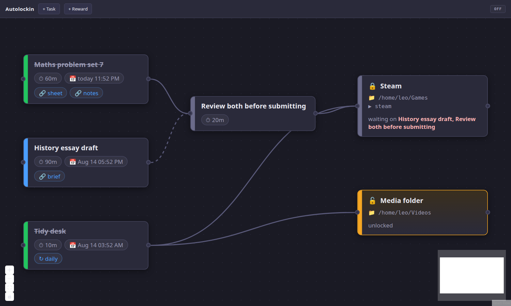

# Autolockin

Your to-do list and homework as an n8n-style flowchart. Each box is a task with a time
estimate, a deadline and the links you'll need. Edges are prerequisites. Finish a chain and
the reward node at the end of it unlocks.



---

## If anything goes wrong

```bash
~/devTools/Autolockin/.venv/bin/autolockin panic
```

That disables enforcement, restores every folder it touched, and stops the daemon. It reads
the ledger directly, so it works even if the daemon is hung or crashed. If even that fails,
these are your own files with no encryption involved — `chmod 755 ~/that-folder` fixes it.

> Worth adding to your shell so you never have to remember the path:
> ```bash
> echo "alias autolockin='~/devTools/Autolockin/.venv/bin/autolockin'" >> ~/.bashrc
> ```
> The rest of this README writes it as plain `autolockin`, assuming you have.

**Right now this is theoretical: the current build ships with enforcement `off` and never
touches your system.** See [Teeth](#teeth) below.

---

## Everyday use

It's already installed. Two commands are all you need day to day:

```bash
systemctl --user start autolockin     # turn it on
systemctl --user stop  autolockin     # turn it off
```

Then open **http://127.0.0.1:8420** in your browser. It only listens on localhost, so
nothing outside this machine can reach it.

Handy extras:

```bash
systemctl --user status autolockin    # is it running?
systemctl --user restart autolockin   # after changing the code
journalctl --user -u autolockin -f    # watch its log live
```

**It does not start on its own.** It's deliberately left disabled, so it only runs when you
start it. If you later want it up automatically whenever you log in:

```bash
systemctl --user enable autolockin      # start at login from now on
systemctl --user disable autolockin     # ...and undo that
```

Prefer to run it in a terminal instead, and stop it with `Ctrl-C`?

```bash
cd ~/devTools/Autolockin && .venv/bin/autolockin serve
```

Your board is saved in `~/.local/share/autolockin/board.json`, not in this folder — so
stopping the service, restarting your PC, or rebuilding the app never loses your tasks.

## Setting it up again from scratch

Only needed on a fresh machine, or if you delete `.venv` / `node_modules`:

```bash
cd ~/devTools/Autolockin
python3 -m venv .venv
.venv/bin/pip install -e .
cd frontend && npm install && npm run build && cd ..

mkdir -p ~/.config/systemd/user
cp install/autolockin.service ~/.config/systemd/user/
systemctl --user daemon-reload
```

## Using the board

- **+ Task** / **+ Reward** add nodes. Click a node's body to open the editor drawer.
- **Drag from a node's right handle to another's left handle** to say "this comes first".
- **Click the coloured bar** on the left of a task to advance it: todo → doing → done.
- **Drag the canvas** to pan, scroll to zoom, and use the buttons at the bottom-left to fit
  everything back on screen.
- **Delete a node** from its editor drawer, or select it and press Backspace.
- Everything autosaves — the header briefly says "saving…" then "saved".

Reward nodes show 🔒/🔓 and spell out what they're still waiting on.

**Building your first chain**, start to finish:

1. Hit **+ Task**, name it *Maths problem set*, set it to 60 minutes and give it a due date.
2. Add a link in **Resources** — the assignment PDF, the lecture notes — so everything you
   need is on the box itself.
3. Hit **+ Reward**, name it *Steam*, and put `steam` in its **Processes** box (or a folder
   path like `/home/leo/Games` in **Folders**).
4. Drag from the task's right-hand dot to the reward's left-hand dot. The reward now says
   *waiting on Maths problem set*.
5. Click the task's coloured bar twice to mark it done. The reward flips to 🔓.

Chain tasks into each other for multi-step work, and point several tasks at one reward when
all of them have to be finished first. A task that feeds a reward through three other tasks
still gates it — the whole upstream chain has to be green.

The colours: grey = todo, blue = in progress, green = done, red = past its deadline.

A task can have a **due date** and can **repeat** daily or weekly. This is what makes the
board reset itself — there's no separate daily cron. When a repeating task's deadline
passes, it flips back to `todo`, and anything downstream of it goes back to 🔒.

> That cuts both ways, deliberately: a daily chore you skip will re-lock a reward you'd
> already earned, mid-session. Once enforcement is armed, that means a running game gets
> killed. Bear it in mind when you decide what to hang off a recurring task.

## Teeth

Enforcement lives behind one setting in `~/.config/autolockin/config.toml`:

```toml
mode = "off"   # "off" | "dry-run" | "armed"
```

| mode | what it does |
|---|---|
| `off` | **the default.** Resolves the board and shows locks in the UI. Never touches your system — no folder is read or chmod'd, no process is inspected or killed. |
| `dry-run` | Runs the enforcement logic and logs what it *would* do to `~/.local/share/autolockin/dryrun.log`, without doing it. |
| `armed` | Actually `chmod 000`s the folders and kills the processes on locked reward nodes. |

The mode is shown permanently in the header — grey `OFF`, amber `DRY-RUN`, red `ARMED` — so
you're never guessing whether the board has power.

**The current build only implements `off`.** The folder-locking and process-watchdog code is
the next piece of work; until it lands, `arm` changes the badge and nothing else. The reward
nodes' folder paths and process patterns are saved and shown, so you can build and live with
your real board first, and confirm the resolution logic behaves before it can do anything.

When it does land, the intended path is: run in `dry-run` for a week, read `dryrun.log`,
confirm it only ever wanted to touch things you meant, *then* `autolockin arm`.

It's a speed bump, by design — `sudo` defeats it in a second. It's meant to interrupt an
impulse, not to beat a determined you.

## Commands

```
autolockin serve      run the daemon (--host, --port)
autolockin status     what mode am I in, what's locked
autolockin panic      unlock everything, stop enforcing, stop the daemon
autolockin restore    unlock everything, leave the mode alone
autolockin disarm     mode -> off, and unlock
autolockin dry-run    mode -> dry-run
autolockin arm        mode -> armed (asks first)
```

## Where things live

**The code**, all under `~/devTools/Autolockin/`:

| | |
|---|---|
| `autolockin/` | the Python daemon — see the module map below |
| `frontend/src/` | the canvas (React + React Flow) |
| `frontend/dist/` | the built UI the daemon serves; regenerate with `npm run build` |
| `tests/` | 36 tests — `pytest` |
| `install/autolockin.service` | the systemd unit, before it's copied into place |
| `.venv/` | Python environment; `autolockin` command is `.venv/bin/autolockin` |

Inside `autolockin/`: `graph.py` is the resolution logic (pure, no I/O), `models.py` the
data shapes, `store.py` atomic saves, `config.py` the enforcement mode, `recover.py` the
panic restore, `cli.py` the commands, `ticker.py` the 5-second loop, `app.py` the server.

**Your data**, which deliberately lives outside the project so nothing here can lose it:

| | |
|---|---|
| `~/.local/share/autolockin/board.json` | your board — tasks, rewards, layout |
| `~/.local/share/autolockin/locks.json` | ledger of original folder modes — the thing `panic` reads |
| `~/.local/share/autolockin/PANIC` | while this exists, nothing is enforced |
| `~/.config/autolockin/config.toml` | the mode (`off` / `dry-run` / `armed`) |
| `~/.config/systemd/user/autolockin.service` | the installed unit systemd actually runs |

**Right now:** the service is installed but **stopped and disabled**, mode is `off`, and
nothing is locked. Confirm any time with `autolockin status`.

The board is seeded with a small example (fake homework, fake paths). Delete those nodes and
build your own, or `rm ~/.local/share/autolockin/board.json` to start empty.

## Development

```bash
.venv/bin/python -m pytest        # backend
cd frontend && npm run dev        # canvas with hot reload, proxied to the daemon on 8420
```

`autolockin/graph.py` holds the resolution logic and is deliberately free of I/O, so
`tests/test_graph.py` covers deadlines, recurrence rollover, diamond dependencies and cycle
detection directly. `tests/test_recover.py` covers the escape hatch. `tests/test_api.py`
includes a test asserting the daemon is inert in `off` mode.

Note `npm audit` reports two advisories in the dev toolchain (esbuild/vite dev server).
They affect `npm run dev` only, not the built static output.
